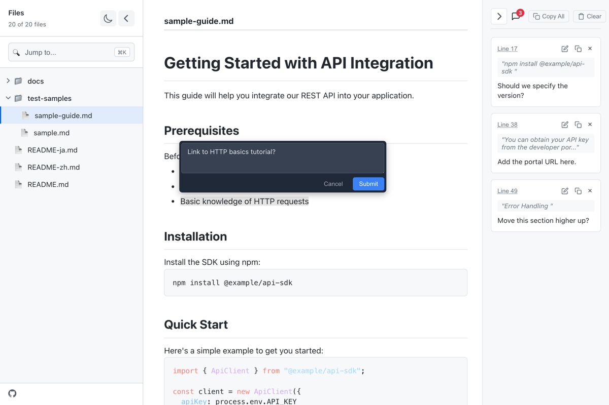

# md-review

[English](./README.md) | 日本語



Markdown ファイルにコメントを付けてレビューするための CLI ツール。
コメントはコピー可能で、AI エージェントへのフィードバックに使える。

## Features

- Markdown をそのままの形式で表示
- 特定の行にコメントを残せる
- ツリービューでファイルを選択
- ダークモード対応（システムの設定に追従）
- サイドバーのリサイズと折りたたみに対応
- コメントの行番号をクリックして該当箇所にジャンプ

## Install

```shell
npm install -g md-review
```

## Usage

```shell
md-review README.md
```

### Options

```sh
-p, --port <port>      Vite server port (default: 6060)
    --api-port <port>  API server port (default: 3030)
    --no-open          Do not open browser automatically
-h, --help             Show help
-v, --version          Show version
```

## License

[MIT](./LICENSE)
